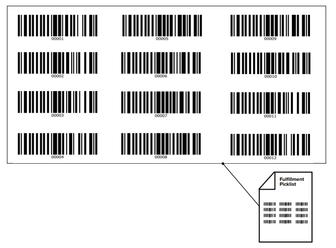

##  密集したバーコードでターゲットのものだけを読み取る設定（Zebra Android端末、Datawedge）

下記の通り、密集したバーコードの中でターゲットのものだけ読み取りたいという要望があります。

 

Zebra Android 端末にはピックリストモードがあります。本モードを設定するとエイマー（光点）にしょうじゅんを合わせたバーコードのみをスキャン・デコードするようになります。

### 設定方法

1. Android 端末でDatawedgeを起動します。
2. Datawedgeで下記設定をします。
   任意のProfile > Configure Scanner Settings > Reader Params > illumination Mode = "Hardware Picklist" or "Software Picklist"

▲ エイマーは機種によって、点灯方法が異なります。

<設定終了>

### 参考資料

1. Picklist Mode 説明資料

https://www.zebra.com/content/dam/zebra_new_ia/en-us/solutions-verticals/product/barcode-scanners/guide/barcode-scanners-guide-scan-picklist-mode-demo-en-us.pdf

2. DataWedgeを使用してTC20とTC25のピックリストモードを有効にする

https://supportcommunity.zebra.com/s/article/Enabling-Picklist-Mode-on-the-TC20-TC25-Using-DataWedge?language=ja